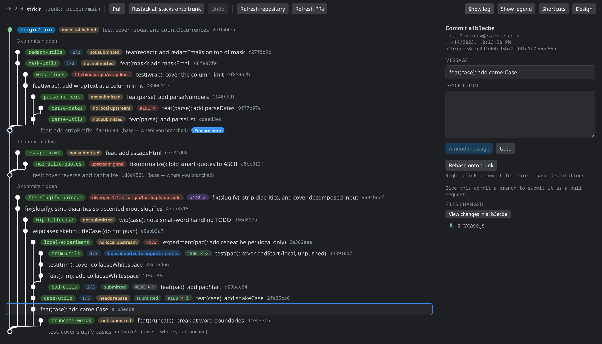

# Git Stack Manager

A [Sapling ISL-style](https://sapling-scm.com/docs/addons/isl/) smartlog for plain Git, running
both as a VS Code extension and as a standalone web app on one shared UI.

Pull request badges and the `gh stack` actions need [GitHub CLI](https://cli.github.com/) and
[gh-stack](https://github.com/github/gh-stack). Everything else works without them.

## Running

Run `just init-repo` once, then pick a host:

- `just install` builds and installs the extension. It opens as *Git Stack: Open Smartlog*, or by
  either of the other two routes under [Opening it](#opening-it).
- `just web <path-to-repo> <port>` serves the same UI in a browser, defaulting to this repository
  on port 6175. `just web-bg` backgrounds it so it survives a terminal or SSH exit.

## Reading the stack

- **Click a commit** for its message, metadata, and changed files.
- **View changes in *hash*** shows every file's diff for that commit as one scrollable read-only
  view with both line-number gutters, which is Sapling's view of the same name. **Open diff view**
  does the same for the selected file, in VS Code's own diff editor where there is one and in the
  same overlay where there is not. **Open current file** opens the file as it is now. Clicking a
  file name runs one of the last two, chosen in **Design**.
- **Open all files** opens every file of the selected commit, in the order the list shows them.
  Each tab opens behind the panel, and holding `⌘` — `Ctrl` off a Mac — does the same for a single
  file, whether you click its row or one of its two icons. macOS gives Control-click to the context
  menu, so the modifier follows the editor's own accelerator rather than accepting both keys.
- **Branch badges** compare each branch to its remote: not submitted, *N* unsubmitted, diverged,
  upstream gone, no local upstream. Where `gh` is available they also carry pull request status,
  meaning the number, the CI rollup, and the review decision.
- **Command log** prints the exact git commands each action ran, in terminal form, grouped per
  action.
- **Legend** explains every pill and badge with a live sample of each, drawn by the same code as
  the tree.
- **Design** sets where the branch pills sit, whether long rows wrap, and how large the text is.
  Putting the pills *after* the subject lines every commit message up on one left edge, which turns
  the tree into a list you can read down; each row's pills follow its own subject, so they stay next
  to the commit they describe. **Long rows** either keep to one line, truncating what will not fit
  so every row is the same height, or wrap and grow the row to match. Wrapping earns its keep once
  the commit panel has taken most of the width. Text and pill sizes scale independently, and the row
  height follows the text. Choices persist per repository.
- The sidebar's **description** box fits itself to the message when you double-click its
  bottom-right corner, and returns to its starting height on a second double-click. Dragging that
  corner still resizes by hand, and double-clicking anywhere else still selects a word.

## Moving around and catching up

- **Goto** checks out the branch on any row, trunk included. The trunk row displays a remote ref
  such as `origin/main`, so its Goto carries the *local* branch tracking that ref: `git switch
  origin/main` would detach HEAD instead of putting you on main. It prefers whatever tracks trunk
  over whatever shares its name, so a local trunk under another name still works.
- **Pull** fetches and fast-forwards the branch you are on, never merging and never rebasing. Pull
  collects work that already happened elsewhere, and either of those is a history decision a Pull
  button should not make on its own. It refuses, changing nothing, on a detached HEAD, a branch
  tracking no remote, a dirty working copy, or a branch that has diverged. The last of those reports
  both counts and points at *Rebase onto trunk*, which carries the whole stack.

## Refreshing the state

- **Refresh repository** re-reads local git state, meaning branches, commits, and the working copy,
  in a handful of local commands. It is cheap and always current.
- **Refresh PRs** runs a `gh pr list` that refreshes the cached pull request data, which otherwise
  holds for a minute. It syncs the number, the CI status, and the review decision. The query names
  the branches on screen and searches each one by name and by tip commit, which keeps it inside
  GitHub's time budget on a large repository and still finds pull requests pushed under a different
  branch name.
- The header reports how the last refresh went: how long ago it succeeded, or that it failed and how
  stale the badges are as a result. A failed refresh keeps the previous badges, so the age is the
  part that says how much to trust them.

## Editing the stack

Every one of these is conflict-free and leaves your working copy alone, except where noted. See
[DESIGN_NOTES.md](DESIGN_NOTES.md) for why.

- **Commit** the changes you tick in the working-copy row, with the message written inline. The rest
  stay uncommitted, so one dirty tree can become several commits.
- **Amend into** folds the ticked changes into a commit that already exists, keeping its message.
  Anything below HEAD is rewritten with its descendants re-parented, so branches in a stack follow.
  The target must be a commit HEAD descends from. A commit on another branch is refused rather than
  left holding a change the working copy still shows.
- **Amend** a commit's message from the sidebar, at any depth in the stack.
- **Amend working changes** into HEAD (`git add -A && git commit --amend --no-edit`).
- **Absorb** folds each uncommitted change into the commit whose lines it touches, previewing the
  placement first. Anything it cannot place confidently stays put.
- **Discard** throws one file's uncommitted change away, from the icon on its row — the control
  Source Control puts in the same place. A tracked file goes back to the version in the commit you
  are on; a file no commit holds yet is deleted, and the card says which of the two is about to
  happen. Every other change stays. This one touches files and Undo does not reach it, so it asks
  first.
- **Split** separates a commit into two, choosing per hunk which changes go first.
- **Fold** combines a commit with the one below, keeping both messages.
- **Rebase** a commit *and its descendants* onto the trunk tip or the stack's own fork base, as
  Sapling's menu does. Every branch pointer in the moving set follows, including mid-chain ones.
  **Restack** is the bulk form: fetch, then rebase every local stack.
- **Undo** reverses the last edit by restoring the refs it moved.
- **Conflicts** are the one case that touches files. They stop the rebase in place and raise a
  banner listing the unmerged files, with a button for your configured merge tool and
  *Continue* / *Abort*.

## Working with GitHub

- **Submit** pushes the selected commit's branch and makes its pull request match the commit
  message: the subject becomes the title and the rest becomes the body, on every submit. A force
  push does not carry the message, so submitting is the only thing that keeps a pull request's
  description current, for the reason [DESIGN_NOTES.md](DESIGN_NOTES.md) gives. A stacked branch
  targets the branch below it rather than trunk, so its pull request shows only its own commit.
  Where the base would widen the diff anyway, the toast reports whether to submit the base too or
  rebase onto it.
- A branch in a [stacked pull
  request](https://docs.github.com/en/pull-requests/how-tos/create-pull-requests/managing-stacked-pull-requests)
  carries its layer position and a *needs rebase* flag on its pill.
- The right-click menu offers `gh stack rebase`, `push`, `submit`, and `sync --prune`, and launches
  `gh stack modify` for drop, reorder, insert, and rename. That TUI already covers restructuring, so
  this extension does not rebuild it.
- `Git Stack: Submit Stack (gh)` runs your stack command in a terminal, configurable through
  `gsm.submitCommand`.

## Opening it

The smartlog is a full editor tab rather than a sidebar view: the tree needs 440 pixels and the
commit panel 340, and a primary sidebar is narrower than their sum. Three ways in, all reading the
first workspace folder, so open a git repository first:

- The **Git Stack** icon in the activity bar. One click opens the tab. VS Code has no "activity bar
  button that runs a command", so the icon's view acts as the trigger: becoming visible opens the
  editor tab and closes the sidebar again.
- The **Source Control** title bar button.
- *Git Stack: Open Smartlog* in the command palette.

## Keyboard

`?` opens the same list inside the app, next to *Show legend*. It is built from the table the key
handler reads, so it cannot fall out of step with what the keys do.

| Key       | Action                                                  |
| --------- | ------------------------------------------------------- |
| `↑` / `k` | Select the commit above                                 |
| `↓` / `j` | Select the commit below                                 |
| `Enter`   | Goto the selected commit                                |
| `a`       | Absorb the working-copy changes                         |
| `u`       | Undo the last history edit                              |
| `r`       | Refresh repository                                      |
| `l`       | Show or hide the command log                            |
| `?`       | Show or hide the keyboard shortcuts                     |
| `Escape`  | Close the open diff, then the panel, then the selection |

Navigation skips the trunk tip, bases, and ellipsis rows, since only commits have actions. Keys are
ignored while a text field has focus, so the message editor still works normally.

Drag the divider left of the commit panel to resize it, between 340 and 640 pixels. A window too
narrow to hold that gives the tree 440 pixels and the panel the rest. The width persists in
`localStorage` under `gsm.sidebarWidth`. Tab to the divider and `←` / `→` nudge it 16 pixels at a
time, `Home` restores the default. Those three keys act only while the divider itself holds focus,
so `←` / `→` never collide with row navigation.

## Settings

- `gsm.trunk` names the trunk ref. Auto-detects `origin/HEAD`, then `origin/main`, `origin/master`,
  `main`, `master`.
- `gsm.submitCommand` is the terminal command behind *Submit Stack*, defaulting to `gh stack`.
- `gsm.onlyMyCommits` dims commits whose author differs from `git config user.email`. Off by
  default, so a shared branch does not look broken.

## Requirements

- **git 2.45+**. Two commands set this floor: `rebase --update-refs`, which is how one rebase
  carries a whole stack, and `for-each-ref --include-root-refs`, which lets the batched read see
  HEAD. Older git rejects the second outright, leaving a graph with no branch pills, no sync badges,
  and no detected trunk, so the read reports the version instead of drawing that.
- **Node 22+**, for subpath imports, the ES2022 output, and `node:test`. Only the web server uses
  your Node; the extension runs on the one VS Code bundles.
- **VS Code 1.106+**, for the extension host API. Web mode does not need it.
- **`gh`**, any version, optional. It supplies the pull request badges and the `gh stack` actions.

## Known limits

- No drag-and-drop rebase yet, Sapling-style. A candidate for a later version.
- Absorb does not follow renames across the stack, which absorb proper does, and cannot yet reassign
  a hunk by hand.
- Split works per hunk rather than per line. A hunk mixing changes you want apart has to be split by
  editing first.
- Local work committed straight onto `main` is not shown. The workflow assumes branch-per-commit.
- Web mode binds to 127.0.0.1 with no auth token. Anything that can reach loopback on that port can
  rewrite history in the served repository, so treat a port-forward as granting write access.
  [SECURITY.md](SECURITY.md) states the whole boundary.
- Undo is session-scoped and ref-only. It does not restore the working copy, and it does not reach
  back past a restart. A discarded change is therefore gone for good, which is why Discard confirms
  and nothing else does.
- Submit handles one branch per click and touches no other. Where the base branch is what widens the
  diff, Submit says so and leaves the fix to you. Submitting a whole stack in one go is
  `gh stack submit`, in the right-click menu.

## Contributing

[CONTRIBUTING.md](CONTRIBUTING.md) covers the build, the task recipes, and the snapshot workflow.
[DESIGN_NOTES.md](DESIGN_NOTES.md) explains why the history edits work the way they do, and
[LEARNINGS.md](LEARNINGS.md) records the cross-cutting traps found while building the webview.
Report a vulnerability through [SECURITY.md](SECURITY.md).

## License

MIT. See [LICENSE](LICENSE).
